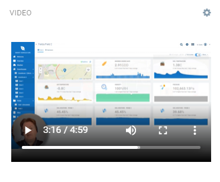

# Video Widget for Cumulocity 

    
This Video widget is the Cumulocity module federation plugin created using c8ycli. This plugin can be used in Application Builder or Cockpit.
The Video widget help you to Plays streaming videos from sources such as HLS streams, on-demand videos (such as MP4, MKV, MOV) from URL and embedded YouTube, Vimeo, etc. videos. In addition, on-demand videos can be synchronized with device measurements representing video timestamp in seconds. Please note that links must be HTTPS and have Cross-Origin access enabled.

### Please note that this plugin is in currently under BETA mode.

### Please choose Video Widget release based on Cumulocity/Application builder version:

|APPLICATION BUILDER | CUMULOCITY | VIDEO WIDGET |
|--------------------|------------|--------------|
| 2.x.x(coming soon) | >= 1016.x.x| 1.x.x        | 

## QuickStart
This guide will teach you how to add widget in your existing or new dashboard.

1. Open you application from App Switcher

2. Add new dashboard or navigate to existing dashboard

3. Click `Add Widget`

4. Search for `Video Widget`

5. Select `Target Assets or Devices`

7. Click `Save`

Congratulations! Video Widget is configured.

### Configuration - to add the widget on dashboard
1. Make sure you have successfully installed the widget.
2. Click on `Add widget`.
3. Choose `Video` widget.
4. `Title` is the title of widget. Provide a relevant name. You may choose to hide this. Go to `Appearance` tab and choose `Hidden` under `Widget header style`.
5. `Target assets or devices` is to select the device. Only select device if you need to synchronize video timestamp with device measurements.
6. `Upload playlist` is to upload a playlist file. Only .m3u playlist file is supported.
7. `Source type` is whether the video is streamed, on-demand or embedded.
8. `Title` is a name for the video to appear in playlist.
9. `URL` is the url of the video.
10. `Delete icon` is to delete a source from the list. Only visible when there more than one source.
11. `Add source` is to add a new source to the list.
12. `Playlist & buttons position` allows to hide the playlist and buttons or show it on top or bottom of the video.
13. `Autoplay` is whether video should start playing automatically after page load.
14. `Default source` is the video that will be played by default on page load.
15. `Loop` is whether the video needs to be replayed. It is only applicable if the default source is of type on-demand.
14. `Measurement` is the device measurements coming in seconds to which video timestamp needs to be synchornized. It is only applicable if the default source is of type on-demand.
15. Click `Save` to add the widget on the dashboard.
16. In case you see unexpected results on the widget, refer to browser console to see if there are error logs.

------------------------------

This widget is provided as-is and without warranty or support. They do not constitute part of the Software AG product suite. Users are free to use, fork and modify them, subject to the license agreement. While Software AG welcomes contributions, we cannot guarantee to include every contribution in the master project.

_____________________

For more information you can Ask a Question in the [TECHcommunity Forums](https://tech.forums.softwareag.com/tags/c/forum/1/Cumulocity-IoT).

  

You can find additional information in the [Software AG TECHcommunity](https://tech.forums.softwareag.com/tag/Cumulocity-IoT).
